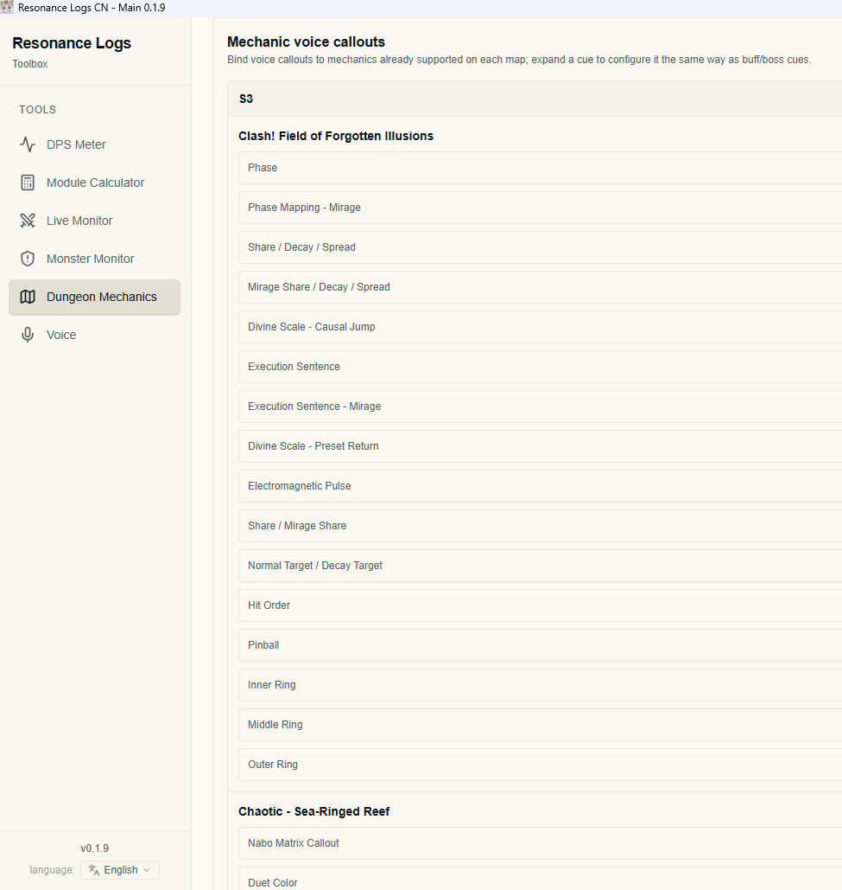

#  Star Resonance DPS meter & Dungeon/Raid BDM & Skill/Buff Trackers Overlay

<div align="center">

#  Resonance Logs Documentation

A feature-rich companion application for **Star Resonance** with DPS analysis, overlays, combat logging, minimap support, dungeon mechanic guides, and more.

[](./README_EN.md)
[](./README_CN.md)

---

### 📖 Documentation

| Document                                                                                            | Description                      |
| --------------------------------------------------------------------------------------------------- | -------------------------------- |
| 📘 [README](README.md)                    | Main documentation               |
| 🇺🇸 [README_EN.md](README_EN.md)         | English documentation            |
| 🇨🇳 [README_CN.md](README_CN.md)         | Simplified Chinese documentation |
| 📝 [CHANGELOG.md](CHANGELOG.md)           | Project changelog                |
| 🍴 [CHANGELOG_FORK.md](CHANGELOG_FORK.md) | Fork-specific changes            |

---

## 🌍 Available Documentation Languages

The documentation is separated by language.

| Language                | Documentation                        | Description            |
| ----------------------- | ------------------------------------ | ---------------------- |
| 🇨🇳 Simplified Chinese | [zh-CN/README.md](doc/zh-CN/README.md) | Default documentation  |
| 🇺🇸 English            | [en-US/README.md](doc/en-US/README.md) | English documentation  |
| 🇯🇵 Japanese           | [ja-JP/README.md](doc/ja-JP/README.md) | Japanese documentation |

</div>

---

> [!IMPORTANT]
> This repository contains the documentation source files only. If you want to contribute translations or improve existing pages, please edit the corresponding language directory.

> [!NOTE]
> Images are shared across all languages. Every language uses the same image assets to keep documentation consistent and reduce repository size.

> [!TIP]
> If you're new to Resonance Logs, start with the English or Chinese README before exploring individual feature documentation.

---

# ✨ Features Preview

### Compact Theme


A minimal interface designed to keep important combat information visible while occupying as little screen space as possible.

---

### Theme Customization


Customize colors, layouts, fonts, and appearance to match your preferences.

---

### Accuracy Test


Verify combat log accuracy and ensure the parser is correctly reading game data.

---

### Dungeon Mechanics Guide Minimap

<table>
  <tr>
    <td></td>
    <td></td>
    <td></td>
  </tr>
</table>
Interactive minimap overlays help players quickly learn dungeon mechanics and positioning.

---

### DPS Overlay as Your Game UI


You can disable the in-game UI and rely on the Resonance Logs overlay for combat information while maintaining a clean gameplay experience.

---

## 🌐 Changing the Application Language



The application supports multiple languages. Open **Settings → Language** to switch the interface language.

> [!TIP]
> After changing the language, restart the application if some interface elements do not immediately update.

---

# 🛠 Building the HTML Documentation

Generate the complete HTML documentation with:

```bash
npm run doc:html
```

This command expands placeholders such as:

```text
{{ui:key}}
```

into their corresponding localized application menu names before generating the documentation.

The generated HTML files are placed in:

```text
doc/html_doc/
```

Open:

```text
doc/html_doc/index.html
```

in your browser to view the complete documentation.

> [!NOTE]
> The generated HTML reflects the application's current localization, making it ideal for publishing or offline browsing.

---

# 🔧 Building a Single Language

For faster development and debugging, generate documentation for only one locale:

```bash
node scripts/build-doc-html.cjs --locale=en-US
```

Replace `en-US` with another supported locale if needed.

---

# 📂 Documentation Maintenance

## Images

All images have a **single source of truth** located in:

```text
shared/img/
```

Do **not** duplicate images into language folders.

Use the following relative paths:

| Document Type     | Image Path                |
| ----------------- | ------------------------- |
| `faq/*.md`        | `../../shared/img/...`    |
| `features/*/*.md` | `../../../shared/img/...` |

> [!IMPORTANT]
> Keeping images centralized prevents inconsistencies and significantly reduces repository size.

---

## UI Menu Placeholders

While writing documentation, use placeholders such as:

```text
{{ui:routes.tools.dps}}
```

During HTML generation, these placeholders are automatically replaced with the correct localized menu names from the application's i18n resources.

> [!TIP]
> This approach allows a single documentation source to remain synchronized with interface translations without manually updating menu names for every language.

---

> [!WARNING]
> Do not manually replace `{{ui:...}}` placeholders with translated text inside Markdown files. Doing so can cause documentation to become outdated when the application's UI translations change.

> [!CAUTION]
> Avoid copying images into language-specific directories. Multiple copies increase maintenance effort and can easily become inconsistent over time.
