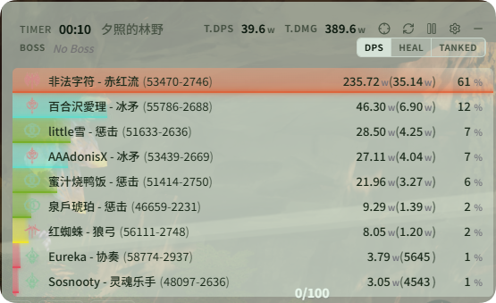
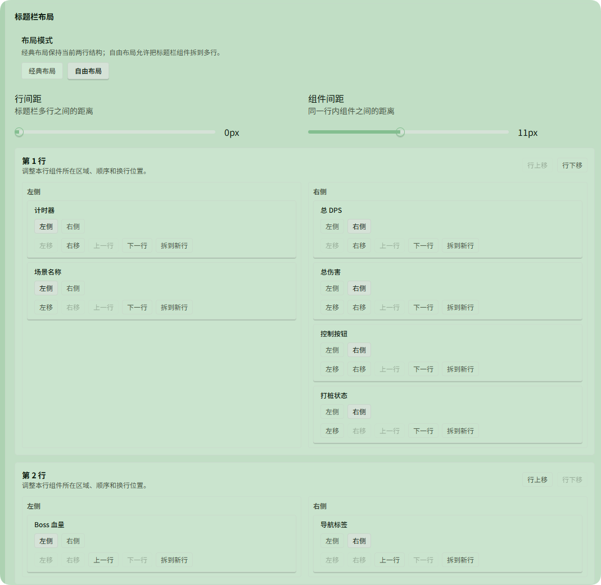

# Themes

Corresponds to **DPS Meter → Themes**.

The DPS UI is **highly customizable**—adjust appearance and layout here.

- **Color themes**: Multiple presets (dark, light, pink, green, matcha, rainbow, etc.), or customize each color
- **Size & layout**: Table, headers, font size, padding, etc.
- **Timer & buttons**: Toggle **Show Active Combat Time**, reset/pause/Boss filter buttons, etc.
- **Columns & order**: Show or hide player/skill metrics in [Settings](./settings.md)

Combine presets and custom options for your preferred DPS display.

## Active Combat Time

- **DPS**: Calculated over wall-clock time for the whole fight
- **True DPS**: Calculated over “active time” when actual damage occurred

Path: **DPS Meter → Themes → Live → Header Settings → Show Active Combat Time**.

## Compact Mode

**Compact Mode** suits a Live DPS window that keeps only core data. When enabled, the live list is simplified—mainly player, class, combat power, season strength, total damage, DPS, true DPS, and share %—with less header and column overhead.

Entry: **DPS Meter → Themes → General → Compact Mode**.

Enable it if your Live view only needs total damage, DPS, and share. Combat power and season strength must be configured in the corresponding settings first; otherwise full info will not appear.

## Title Bar Free Layout

The title bar supports free layout—control placement and order of timer, Boss HP, button area, and more.

Entry: **DPS Meter → Themes → Live → Header Settings**.

In **Header Settings** you can also adjust Boss HP display, including a horizontal option for narrow windows that still need Boss HP.

Enable **Show Training Dummy Button** to show the crosshair on the Live header for toggling [training dummy mode](./README.md#training-dummy-mode).

More setting paths: [Settings paths](./settings.md).
