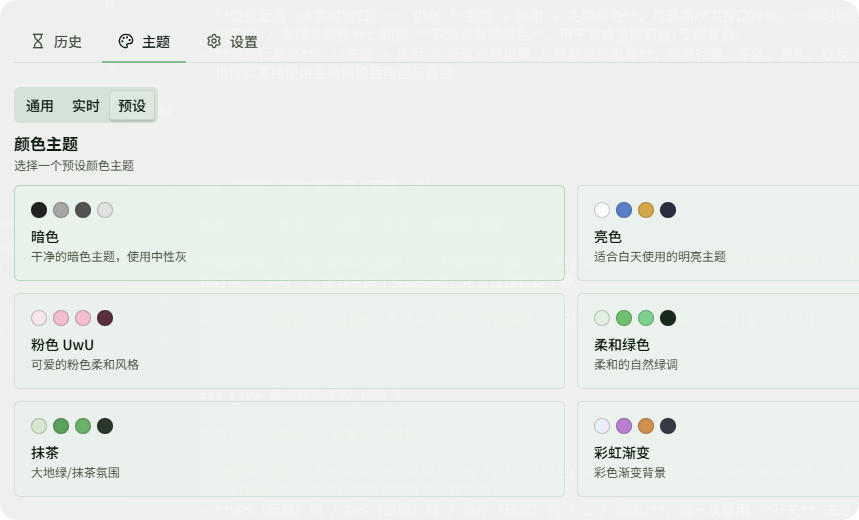

# FAQ · DPS 与布局

## DPS 相关

### 秒伤和真秒伤有什么区别？

- **秒伤 (DPS)**：总伤害 ÷ 战斗总时长
- **真秒伤 (TDPS)**：总伤害 ÷ 全局**活跃战斗时间**（排除长时间停手、跑路等空档）

### 历史记录会自动清理吗？

历史记录超过 200 条时，下次启动应用会自动按时间删除较早记录，并重置序列。

---

## 布局与外观（该去哪里改？）

### Live（实时）窗口怎么变「透明」？

**主题颜色里的「背景（实时）」**：

1. 打开 **DPS检测 → 主题 → 通用**（第一个标签）。
2. 展开 **主题颜色 → 自定义颜色主题**。
3. 找到 **背景（实时）**，把颜色的 **透明度** 调低

---

### 自定义颜色

- **整页配色（含实时窗口）**：仍在 **主题 → 通用 → 主题颜色**，可逐项改主窗口背景、**实时窗口背景**、文字、按钮、边框、**表格文字**、**K/M/% 后缀颜色**、提示框等；每项都支持带透明度。
- **职业 / 专精条颜色**：同页 **职业与专精颜色**，用于表格里按职业/专精着色。
- **表格行高亮**：**主题 → 通用 → 玩家表格设置 / 技能表格设置**，可改行高、字体、表头、以及 **行高亮透明度**、**技能行高亮透明度** 等（说明：控制彩色条有多「实」）。
- 也可以直接使用主题预设后再自己调整

---

### 标题栏（实时窗口最上面那一条）

路径：**DPS检测 → 主题 → 实时 → 标题栏设置**。

可调整例如：**窗口整体内边距**、**标题栏内边距**；是否显示 **战斗计时**、**活跃战斗时间**、**场景名称**、**总伤害 / 总 DPS**、**Boss 血量**；是否显示 **重置 / 暂停 / 仅 Boss / 设置 / 最小化** 等按钮；以及 **底栏 DPS·治疗·承伤** 切换标签和对应 **字号**。按需关掉不关心的项，可以让顶栏更干净。

同页 **实时窗口显示设置** 里还有 **点击穿透模式**：开启后，鼠标会「穿过」实时窗口点到背后的游戏.

---

### Live 展示哪些字段（列）？

路径：**DPS检测 → 设置 → 实时**。

- **通用设置**：你的名字/他人名字显示成「名称」「职业」或组合、是否显示能力评分/赛季强度、条形图是否相对 **全场最高**、DPS/HPS 等是否缩写等。
- **DPS（玩家）列 / DPS（技能）列 / 治疗（玩家）列 / … / 承伤…**：每一块里用 **开关** 决定 **这一列要不要出现在实时表里**。
- 在同一区域通常还有 **上移 / 下移**，用来 **调整列的顺序**（只影响实时窗口）。

---

### 历史详情展示哪些字段（列）？

路径：**DPS检测 → 设置 → 历史**。

结构与实时类似：**通用设置**（名称、评分、条形图基准、缩写风格等）加上 **DPS（玩家）列 / DPS（技能明细）列 / 治疗… / 承伤…**，用开关控制 **打开某条历史记录时** 表格里出现哪些列。历史与实时的列设置 **互不影响**，可按习惯分别精简。
