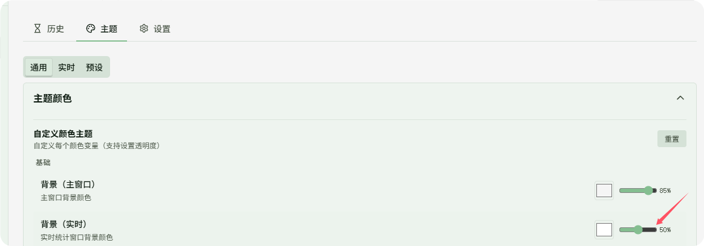
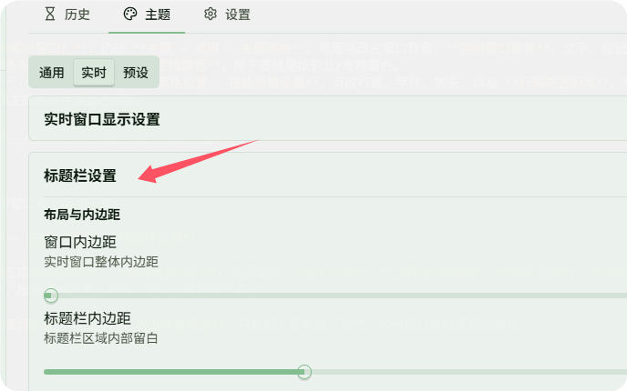

# FAQ · DPS とレイアウト

**詳細**：[DPS 概要](../features/dps/README.md) · [テーマ](../features/dps/themes.md) · [履歴](../features/dps/history.md) · [設定](../features/dps/settings.md)

## DPS 関連

### 秒間ダメージと真秒間ダメージの違いは？

- **秒間ダメージ (DPS)**：総ダメージ ÷ 戦闘の総時間
- **真秒間ダメージ (TDPS)**：総ダメージ ÷ グローバルな**活動戦闘時間**（長時間の手止め、移動などの空き時間を除く）

### 履歴は自動でクリーンアップされますか？

履歴が 200 件を超えると、次回アプリ起動時に古い記録を時間順に削除し、シーケンスをリセットします。

---

## レイアウトと外観（どこで変更する？）

### ライブ（リアルタイム）ウィンドウを「透明」にするには？

**テーマ色の「背景（リアルタイム）」**：

1. **DPS測定 → テーマ → リアルタイム**（最初のタブ）を開く。
2. **テーマ色 → カスタムカラーテーマ** を展開。
3. **背景（リアルタイム）** を見つけ、色の**透明度**を下げる。

---

### カスタムカラー

- **ページ全体の配色（ライブウィンドウ含む）**：引き続き **テーマ → 一般 → テーマ色** で、メインウィンドウ背景、**ライブウィンドウ背景**、文字、ボタン、枠、**テーブル文字**、**K/M/% 接尾辞の色**、ツールチップなどを個別に変更可能。各項目で透明度も設定できます。
- **職業 / 特化のバー色**：同ページの **職業と特化の色** で、テーブル内の職業・特化別の色分けに使用。
- **テーブル行のハイライト**：**テーマ → 一般 → プレイヤーテーブル設定 / スキルテーブル設定** で行の高さ、フォント、ヘッダー、**行ハイライトの透明度**、**スキル行ハイライトの透明度** などを変更（カラー帯の「濃さ」を調整）。
- テーマプリセットを適用したうえで微調整することもできます。

---

### タイトルバー（ライブウィンドウ最上部の帯）

パス：**DPS測定 → テーマ → リアルタイム → タイトルバー設定**。

例：**ウィンドウ全体のパディング**、**タイトルバーのパディング**；**戦闘タイマー**、**活動戦闘時間**、**シーン名**、**総ダメージ / 総 DPS**、**Boss HP** の表示；**リセット / 一時停止 / Boss のみ / 設定 / 最小化** などのボタン；**フッターの DPS・回復・被ダメ** 切替タブと**フォントサイズ** などを調整できます。不要な項目をオフにすると上部がすっきりします。

同ページの **ライブウィンドウ表示設定** に **クリックスルー（貫通）モード** もあります。有効にすると、マウスがライブウィンドウを通過して背後のゲームを操作できます。

---

### ライブで表示する項目（列）は？

パス：**DPS測定 → 設定 → リアルタイム**。

- **一般設定**：自分/他人の名前を「名称」「職業」または組み合わせで表示するか、能力スコア/シーズン強度の表示、バーが **パーティ最高** かどうか、DPS/HPS などの略記など。
- **DPS（プレイヤー）列 / DPS（スキル）列 / 回復（プレイヤー）列 / … / 被ダメ…**：各ブロックの**スイッチ**で **ライブ表に列を出すか** を決めます。
- 同じエリアに通常 **上へ / 下へ** があり、**列の順序** を調整できます（ライブウィンドウのみに影響）。

---

### 履歴詳細で表示する項目（列）は？

パス：**DPS測定 → 設定 → 履歴**。

リアルタイムと同様の構成：**一般設定**（名称、スコア、バー基準、略記スタイルなど）に加え、**DPS（プレイヤー）列 / DPS（スキル明細）列 / 回復… / 被ダメ…** で、**履歴を開いたとき** テーブルに出す列をスイッチで制御します。ライブと履歴の列設定は**互いに独立**なので、用途に合わせてそれぞれ整理できます。
