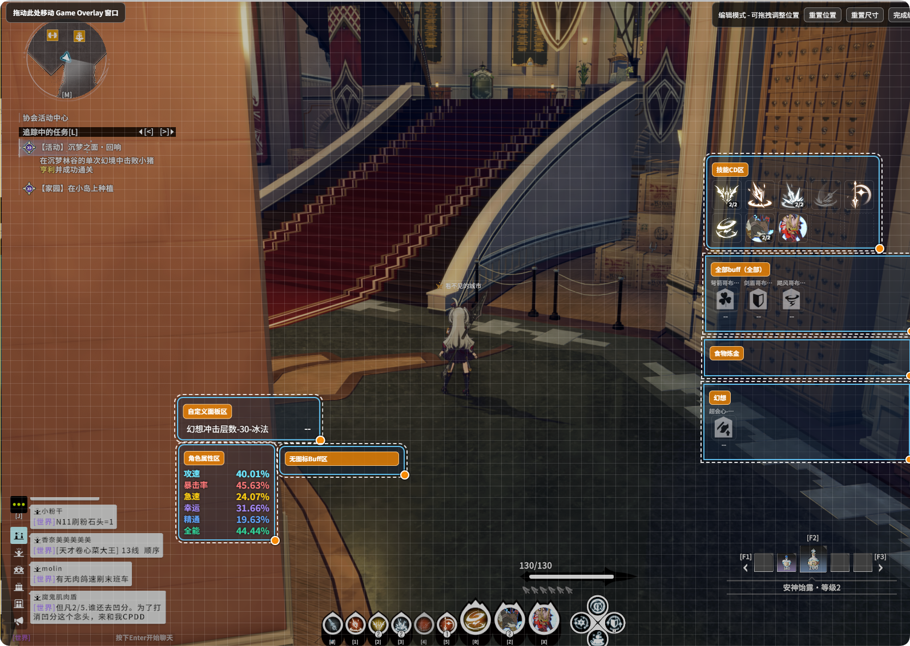

# Buff 監視

**ライブモニター → Buff モニター** に対応します。

## 独立モード / グループモード

- **独立モード**：各 Buff を個別表示。アイコンサイズ、位置を個別設定可能

- **グループモード**：複数 Buff を 1 グループにまとめ、レイアウトを統一

## 特殊 Buff

一部 Buff は**スタック数**に応じて表示効果が変わります（例：1 スタックと 2 スタックで異なるアイコン）。このような Buff を特殊 Buff と呼びます。追加設定は不要で、通常 Buff と同様に監視リストへ追加するだけで、オーバーレイがスタック数に応じてアイコンを自動切り替えします。

**使い方：**

1. **ライブモニター → Buff モニター** で対象 Buff を監視に追加（Buff 名で検索可能）
2. 特殊 Buff として設定済みの場合、アイコンはスタック数に応じて自動変化。追加設定は不要

**現在サポートしている特殊 Buff：**

| 職業 | Buff 名 | 効果説明 |
|------|-----------|----------|
| 青嵐騎士 | 追撃身法 | 1 スタックは単一アイコン、2 スタックは二重アイコン組み合わせで、スタック状態を区別しやすい |

## Buff エイリアス

ゲーム内の一部 Buff 名は分かりにくいため、**Buff監視 → Buffエイリアス設定** で設定できます。

- 元の名称を検索（例：`[热枕]`）
- 表示名を設定（例：「生命波动」）

エイリアスは**グローバルに有効**で、プリセット切り替えでは変わりません。

## 監視したい Buff を素早く見つけるには？

Buff 設定名が分かりにくい場合、対象 Buff の正確な名称が不明なときは、まず**グループモード**で某グループに「すべて監視」をオンにし、オーバーレイにすべての Buff が表示されたら実際の効果から名称を確認し、正確な監視リストへ追加してください。

## カテゴリクイックモニター

- **食物**：すべての食事 Buff を一括監視
- **炼金**：すべての錬金 Buff を一括監視

**Buff監視 → カテゴリクイックモニター** で使用するか、グループモードのショートカットボタンを利用します。

## Buff 優先度

- **グローバル Buff 優先度**：独立モードで、グローバルリスト内の Buff 表示順を制御
- **グループ内優先度**：グループモードで、各グループごとにグループ内の優先度を個別設定

## Buff カウントダウンアラート

監視中の Buff に**残り時間アラート**を設定可能。設定秒数未満でハイライト色、オプションで点滅。まもなく終了する Buff に注意しやすくなります。

## すべての Buff を監視（独立モード）

独立モードで **すべての Buff を監視** をオンにすると、現在受信したすべての Buff をオーバーレイに表示（名称の確認向け）。グループモードの「グループ · すべて監視」と似ていますが、レイアウトロジックは異なります。

## Buff グループ管理（グループモード）

- **グループの新規作成 / 削除**。各グループで Buff を個別に選択するか **すべて監視** をオン
- グループに **食物 / 炼金** カテゴリをショートカット追加、または追加済みカテゴリを **削除**
- 各グループで **アイコンサイズ、行数/列数、間隔**、名称/残り時間/スタック数の表示有無を設定

## アイコンなし Buff

アイコンがない Buff は**1 行のプログレスバー**で表示。**アイコンなし新スタイル** または **アイコンなし旧スタイル** を選択でき、**最大表示数** を制限。名称/数値/プログレスバーの色などは Buff 表示モード関連設定で調整します。
