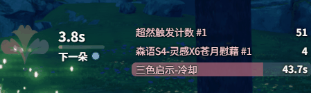

# Changelog v0.2.4

## 更新内容

### DPS / 历史

- 技能详情增加最大、最小、平均伤害统计(DPS检测-设置-实时/历史)
- 修复死亡回放可能的 key 冲突

### 方案

- 方案支持关联角色专精，切换职业时自动变更(监控方案-关联专精)
  - 可开启「按专精自动切换」
- 新增愈合方案预设，调整其他预设增加 Buff 覆盖率
- 新增重装方案预设

### 遮罩监控相关

- 怪物监控新增当前攻击主目标生命条(怪物监控-生命条) @dilone
- 拆分资源区可独立显示控制
- 增加愈合三花倒计时至资源区(实时监控-Overlay 区域显示-资源分区)
  - buff 预警使用 2202716 关联此区域的预警
  - 该逻辑适配 S4 的新逻辑, jp, global 服务器暂不适用

  

- Buff 搜索支持直接设置未知 Buff ID，搜索结果分页展示避免搜索卡顿
- 新增森语 S4-灵感X6苍月慰藉计数(实时监控-自定义监控-添加计数器)
- 技能轴增加爆炸射击、炎魔天落杀、神罚之镰、重装神影螺旋
- 重装普攻增加派生疾驰锋刃, 并低于派生龙击跑的显示
- 增加双斧荒川 CD
- 修复 Buff 覆盖率即使不实时显示普通 Buff 区也无法监听的问题
- 开关实时监控等先检查窗口是否被最小化，如果是则弹出
- 增加快捷键一键最小化/弹出 DPS 与遮罩窗口(DPS检测-设置-快捷键)

### 数据

- 更新 26.9.4 星痕共鸣正式服 1.2.45164.0 数据 @YozoraHoshi

## 注意事项

### 兼容性提醒

- 如果之前使用过 0.0.2 或 0.0.3，第一次使用 0.0.4-0.2.4 需要清理 `%LOCALAPPDATA%\resonance-logs-cn` 目录下的 `resonance-logs-cn.db`，再重新启动应用
- 0.2.2, 0.2.1 经历了大量重构，若原有功能出现问题请及时联系我
- 0.2.2 修改了表字段, 老的历史记录报错是正常现象, 新的正常
- 语音播报需单独下载模型；首次生成短句可能耗时较长，生成完成后播放不再加载模型

### 特别注意

- 如果你自己修改了代码又不想提交 PR，在分享给其他人的时候请把应用名、版本号等原版相关信息都改掉，不要带着原仓库的信息，尤其是应用名和版本号
- 关闭按钮现在会隐藏到右下角，可以将隐藏栏的内容拖到右下角显示，避免窗口程序过多时无法快速找到
- 常见问题见使用手册中的 HTML

### 社区

- QQ 群：`1084866292`
- Discord：https://discord.gg/RHeX47wvDU
