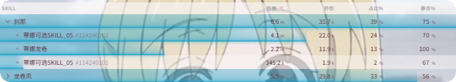

# DPS 检测

实时伤害统计、历史记录及自定义列设置说明。

## 概述

DPS 检测通过网络抓包解析战斗数据，支持：

- **实时统计**：战斗中即时更新伤害、秒伤等
- **历史记录**：保存往期战斗
- **多维度数据**：伤害、治疗、承伤（DPS / HPS / TPS）

## 子文档

| 文档 | 对应界面 | 说明 |
|------|----------|------|
| [主题](./themes.md) | DPS检测 → 主题 | 颜色、紧凑模式、标题栏、活跃战斗时间 |
| [历史记录](./history.md) | DPS检测 → 历史 | 复盘、目标拆分、自动清理 |
| [设置](./settings.md) | DPS检测 → 设置 | 列显示、刷新频率、网络、快捷键 |

## 打桩模式使用说明

打桩模式适合在固定木桩场景下单独记录一轮输出。结束后 **Live 界面会冻结在当前数据**，便于直接查看技能占比与秒伤，无需立刻打开 [历史记录](./history.md)。

### 入口

- **显示打桩按钮**：`DPS检测 → 主题 → 实时 → 标题栏设置 → 显示打桩按钮`（见 [主题](./themes.md)）
- **启动/关闭**：实时窗口头部的准星按钮

无需在设置里预先选择木桩类型。开启打桩模式后，当你**首次对支持的木桩造成伤害**时，会自动识别并锁定是 **精英敌方木桩** 还是 **精英守护木桩**（由实际命中的目标决定）。

### 状态流转

```
待打桩（打桩待命） → 打桩中 → 打桩结束
         ↑                              |
         └──────── 点击「重置」 ──────────┘
```

- **打桩待命**：已开启打桩模式，等待你对木桩首次造成伤害以自动锁定目标
- **打桩中**：已锁定当前木桩，只统计该目标的战斗数据
- **打桩结束**：本轮统计已定格，Live 不再刷新；由你自行决定何时开始下一轮

下一轮需先点击 **重置** 回到 **打桩待命**，再对木桩造成伤害才会重新进入 **打桩中**。不会在打桩结束后因再次攻击而自动开新一段。

### 使用流程

1. 在标题栏设置中确保已显示打桩按钮，于 Live 窗口点击准星开启打桩模式（**打桩待命**）。
2. 对 **精英敌方木桩** 或 **精英守护木桩** 首次造成伤害后，自动锁定该木桩并进入 **打桩中**。
3. 打桩过程中仅累计锁定木桩相关数据；同队他人对该木桩的伤害若出现在统计中属正常现象。
4. 达到单轮时长上限后进入 **打桩结束**，Live 冻结便于查看；本轮数据同时写入 [历史记录](./history.md)。
5. 查看完毕后点击 **重置** 回到 **打桩待命**，在你准备好时再对木桩出手开始下一轮。

### 注意事项

- 仅**你本人**对支持木桩的首次伤害会触发锁定与正式开始记录。
- **打桩结束** 后再次攻击不会自动开始新一段，必须 **重置** 后再打。
- 也可在 **打桩中** 提前点击 **重置** 结束当前轮并回到 **打桩待命**。
- 关闭打桩模式（再次点击准星）会退出打桩状态。
- 出协会、切图、换线等导致场景变化时，会自动取消打桩模式，需重新开启。

## 数据指标说明

### 技能栏构成

DPS 技能栏按客户端的 DPS 逻辑展示：每个技能下可能有多个伤害来源，每条伤害会按固定规则拼接成**伤害 ID**，再根据伤害 ID 聚合成单个技能进行展示。因此点开部分技能时会看到多条细分条目。




聚合规则简要说明：

1. **原始伤害条目**：每次命中对应一条记录，包含技能 ID、伤害来源、命中事件 ID 等
2. **聚合展示**：相同伤害 ID 的条目合并为一个「技能」显示；展开时可看到该技能下的多个子条目

### 真秒伤与活跃战斗时间

- **秒伤**：按整场战斗的挂钟时间计算
- **真秒伤**：按「有实际伤害发生的活跃时间」计算

在 **DPS检测 → 主题 → 实时 → 标题栏设置** 中可勾选「显示活跃战斗时间」以查看活跃时间。详见 [主题](./themes.md)。

### 治疗 / 承伤列

治疗与承伤模式使用类似列结构，分别统计 HPS（秒疗）、TPS（秒承伤）及暴击、幸运等相关指标。

## 重置逻辑

战斗统计的切分与重置规则如下：

| 场景 | 行为 |
|------|------|
| **切图** | 切换场景/地图时：若本场已有战斗数据，会入库为一条历史记录；实时窗口不会立刻清零，在你**下次造成伤害**后自动重置并开始新场景统计 |
| **大师本** | 自动切分道中和 Boss，历史记录为 2 条：道中一段、Boss 一段 |
| **团本** | 每个 Boss 独立切分，每个 Boss 对应一条历史记录 |
| **团灭** | 团灭时自动重置当前统计 |

### 切图说明

- **有数据才处理**：切图前若没有任何有效战斗统计（例如未开打），则不会额外写入历史，也不会触发上述延迟重置。
- **实时 vs 历史**：历史在切图时保存；实时 DPS 界面保留上一场数据直到你再次出手，避免切图瞬间数字突然消失造成误解。

同一场景下的重置均为「下次攻击目标后」自动触发：

- **大师本**：清完道中后，首次攻击 Boss 时自动重置，Boss 段单独统计
- **团本**：每次攻击新 Boss 时自动重置
- **团灭后**：下次攻击 Boss 时自动重置
