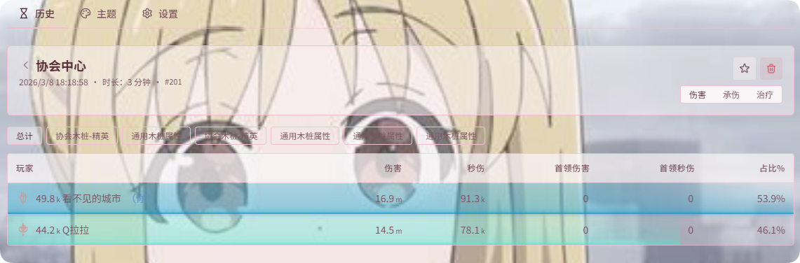

# 历史记录

对应 **DPS检测 → 历史**。

历史记录相比实时统计能展示更完整、更细分的复盘数据，例如：

- **对每个目标的伤害构成**：按目标（首领、小怪等）拆分各技能的伤害
- **技能分布详情**：展开后可查看技能下的多条伤害来源
- **完整战斗数据**：包含整场战斗的汇总统计

- 历史记录超过 200 条时，下次启动会按时间自动清理较早记录并重置序列。因此不需要特意维护历史数据。

打桩模式在 **打桩结束** 时也会将本轮结果写入历史；日常复盘可直接在冻结的 Live 界面查看，需要对比多场时再打开历史。详见 [DPS 总览 · 打桩模式](./README.md#打桩模式使用说明)。
