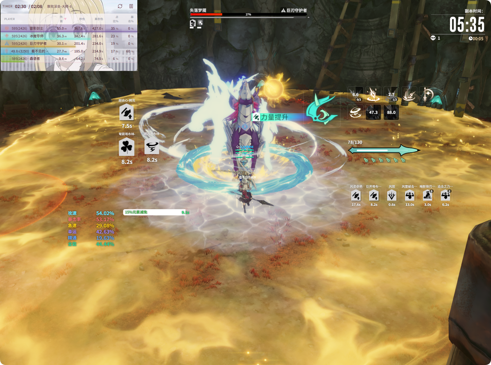

# Buff 监控

技能 CD、Buff 监听、自定义面板等功能说明。

## 概述

实时监控 分为以下几个部分：

- **技能 CD**：监控技能冷却
- **Buff 监控**：监听指定 Buff 的持续时间、层数等
- **角色面板**：显示攻速、暴击率、智力等属性
- **自定义监控**：普通监控区、因子区、计数器与 Buff 进度条
- **启用窗口**：遮罩浮窗模块开关与布局编辑

> **⚠️ 中途打开应用**：若在游戏进行中才打开本应用，技能 CD、角色面板属性等可能显示不全。这是因为游戏仅会推送**增量更新**，应用无法获取当前完整状态。解决方式：**切图**（切换场景/地图）一次，触达全量属性同步后，显示即会恢复正常。

## 子文档

| 文档 | 对应界面 | 说明 |
|------|----------|------|
| [技能 CD](./skill-cd.md) | 实时监控 → 技能CD | 职业技能勾选、技能变换 |
| [Buff 监控](./buff.md) | 实时监控 → Buff监控 | 独立/分组、别名、快捷监听 |
| [角色面板](./panel-attr.md) | 实时监控 → 角色面板 | 属性勾选、颜色、行顺序 |
| [自定义监控](./custom-panel.md) | 实时监控 → 自定义监控 | 普通区、因子区、计数器、进阶示例 |
| [启用窗口](./overlay.md) | 实时监控 → 启用窗口 | 遮罩开关、模块显示、布局编辑 |

## 启用与方案

- **启用实时监控**：页面顶部总开关；关闭后不再向浮窗推送数据。
- 顶栏 **切换遮罩窗口** / **编辑遮罩布局** 见 [启用窗口](./overlay.md)。

## 方案

- 不同职业/玩法可创建不同**方案**
- 每个方案可配置独立的技能 CD、Buff 监听、布局等
- 切换方案即可切换整套监控配置

## 最佳实践

配置完成后，建议使用 **`Ctrl+\`** 进入**无 UI 模式**：主界面收起，仅保留浮窗显示技能 CD、资源、Buff 等。将浮窗置于屏幕边缘或视线余光处，即便屏幕较大也无需低头查看，即可掌握冷却与资源情况。

