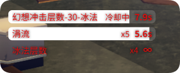
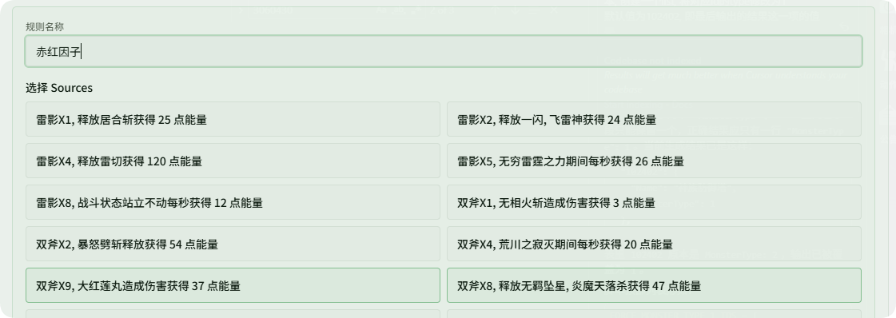
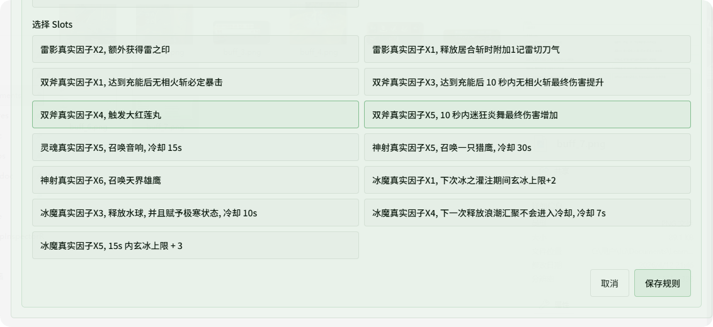
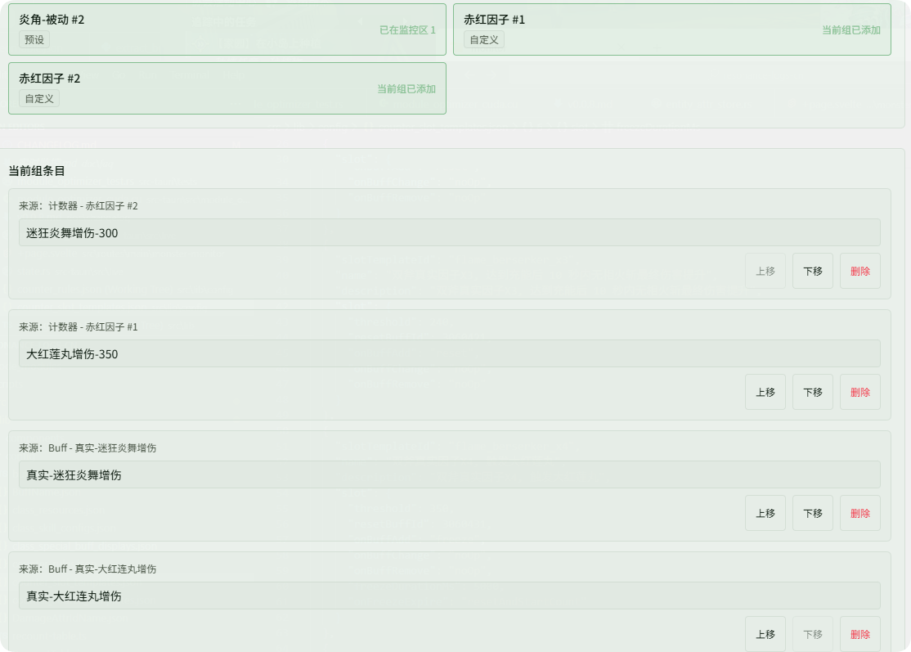
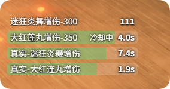
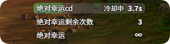
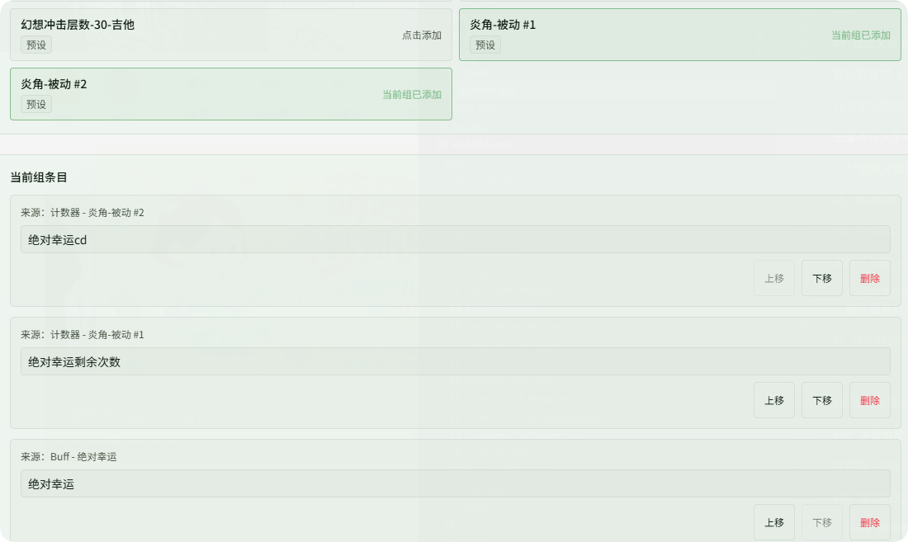

# 自定义监控

对应 **实时监控 → 自定义监控** Tab。

可创建多个**文本监控区**，在浮窗中以进度条等形式展示 Buff 或计数器。同一 Buff 或计数器槽位在全部监控区内**全局唯一**（不能重复添加到多个区）。

## 普通自定义区与因子区

| 类型 | 创建方式 | 用途 |
|------|----------|------|
| **普通自定义区** | **新建监控区** | 手动添加 Buff、预设/自定义计数器，自由组合 |
| **因子配置区** | **新建因子区** | 自动展示当前角色**赛季养成因子**相关进度，无需手配 Sources/Slots |

### 因子区（新建因子区）

点击 **新建因子区** 后，应用会根据当前角色已装配的因子路径，在浮窗中自动生成对应条目，典型包括（以实际装配为准）：

- **真实因子 A / B 能量**（计数进度）
- **真实因子 A / B Buff 效果**（关联 Buff 持续时间等）

**同步与变更：**

- **切图**后会做一次整体数据同步；之后在游戏内**切换因子路径**或**更换装填因子**时，因子区展示会随之更新，无需重新建区。
- 因子区**不能**像普通区那样手动「添加 Buff / 计数器」；条目由系统自动维护。

**显示名称：**

- **因子能量等计数类**条目：在因子区选中后，于 **因子显示名** 中搜索 slot（名称 / 描述）并设置自定义名称；按 slot 模板保存，方案切换后仍会沿用。
- **因子 Buff 效果**条目：在 [Buff 监控 → Buff 别名设置](./buff.md#buff-别名) 中重命名（别名全局生效）。

因子区与普通区一样可设置**监控区名称**、**样式**（行间距、字体、颜色等），并在 [启用窗口](./overlay.md) 中通过 **自定义监控区** 开关整体显示/隐藏。

## 普通自定义区

### 监控区与样式

- 每个普通区在浮窗中为**独立文本区域**，可单独拖拽、缩放（见 [启用窗口](./overlay.md) · 编辑遮罩布局）。
- **监控区名称**、**当前监控区样式**（行间距、字体大小、名称与数值间距、名称/数值/进度条颜色及透明度）按区独立保存。

### 计数器

支持「关联 Buff、伤害类型」的状态机，用于计数一些非 Buff 维护的特殊触发，例如：

- 幻想冲击的计数
- 超然触发的计数

在选中普通自定义区后，通过 **添加计数器** 配置。计数器槽位全局唯一，预设规则与自定义规则会一并列出。

### 添加 Buff

仅添加到**当前**普通自定义区的文本区域；可从 Buff 搜索 grid 选取（已在其他区占用的 Buff 不可重复添加）。

### 当前组条目

已加入的 Buff / 计数器可调整显示名称（计数器）、排序（上移/下移）或移除。

## 自定义计数器规则

除使用内置预设外，可自行编写 **自定义计数器规则**：指定哪些游戏事件作为 **Sources（来源）** 推进计数，以及用哪些 **Slots（槽位 / 效果位）** 在面板上展示进度或状态。入口：**实时监控 → 自定义监控 → 自定义计数器规则**。

**一般流程：**

1. **新建规则**，在 **Sources** 中勾选或添加需要的来源（可多选）。
2. 在 **Slots** 中选择要在自定义面板里绑定的槽位（可多选），与规则逻辑一一对应。
3. 填写 **规则名称** 后**保存**。
4. 到普通自定义区 **添加计数器**，为刚保存的规则选择对应 Slot；需要同时看的 **Buff 监听** 与 **计数器** 可放在**同一浮窗区域**，便于一眼对照。

## 进阶示例

### 赤红流（双斧因子）

以下以 **赤红流** 为例：用双斧相关因子来源驱动计数，并用指定槽位展示因子能量与触发相关进度。

**1. 配置 Sources 与 Slots 并保存规则**

- 点击 **新建规则**。
- **Sources** 选择 **双斧X9**、**双斧X8**（作为计数来源）。

- **Slots** 选择 **双斧X4**、**双斧X5**，填写规则名称后 **保存**。

**2. 布局：因子触发 Buff 与因子能量计数同区**

在浮窗或自定义面板布局中，将 **因子触发相关 Buff** 与 **因子能量计数** 放在**同一显示区域**，便于同时看到「是否触发」与「能量/进度」。

**3. 浮窗效果**

配置完成后的整体展示可参考下图：

### 预设监控：炎角-被动

应用内置 **炎角-被动** 预设规则，用于在自定义面板中观察炎角被动与「绝对幸运」相关状态，无需从零配置计数器与槽位。

**规则要点：**

- **Slot 1（伤害型专精计数）**：按技能完成施法累计次数，以「距离阈值还差几次」的方式展示，便于看出**绝对幸运**还剩多少次触发机会。
- **Slot 2（绝对幸运 CD）**：与被动 Buff 联动展示冷却进度；**平稳期**约 **15 s**，在特定条件下（如释放主动相关 Buff 生效时）会变为约 **5 s** 的计时表现。

**推荐用法：**

1. 在 **自定义计数器规则** 中选用或保存 **炎角-被动** 预设后，在自定义面板里**添加计数器**，为该规则选择对应的 **Slot 1、Slot 2**。
2. 同时在 [Buff 监控](./buff.md) 中加入 **「炎角-被动-幸运」**（绝对幸运 Buff），与上述两条计数器**放在同一显示区域**，即可在浮窗上同时看到幸运 Buff 与计数、CD 的配合信息。

浮窗上的展示效果可参考下图：

在 **自定义面板 / 计数器规则** 中的典型设置可参考下图：

