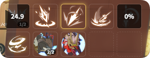

# 技能 CD

对应 **实时监控 → 技能CD**。

若中途才打开应用导致 CD 显示不全，请先 [切图同步](../README.md#buff-监控)（见总览说明）。

## 职业与技能 CD

- **职业选择**：切换当前方案监控的职业，技能列表随职业变化（与 [方案](../README.md#方案) 绑定）。
- **技能选择**：最多勾选 **10** 个技能（浮窗约 2 行 × 5 列），显示冷却与剩余时间；可一键清空重选。

## 持续时间技能

部分技能除 CD 外还有**持续生效时间**（如地面效果、引导等），可在 **持续时间技能** 中单独勾选；与上方技能 CD 列表独立配置，浮窗在 **技能持续区** 展示（见 [启用窗口](./overlay.md)）。

## 共鸣技能

**共鸣技能** 需通过搜索按名称添加，不随职业表自动列出；已选列表可单独管理，适合监控共鸣类特殊技能。

## 监控预览

页内 **监控预览** 按当前勾选顺序展示图标排列效果，便于调整顺序后再到游戏中查看。

## 技能变换

部分技能会在特定 Buff 生效时变为另一形态，技能 CD 栏会根据当前 Buff 状态自动切换图标与名称。例如青岚骑士的「飞鸟投」在拥有特定 Buff 时显示为「极·岚切」；冰法的「寒冰风暴」在免读条 Buff 下显示为「免读条的寒冰风暴」。

